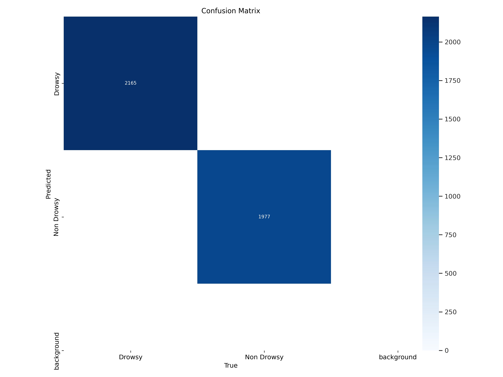
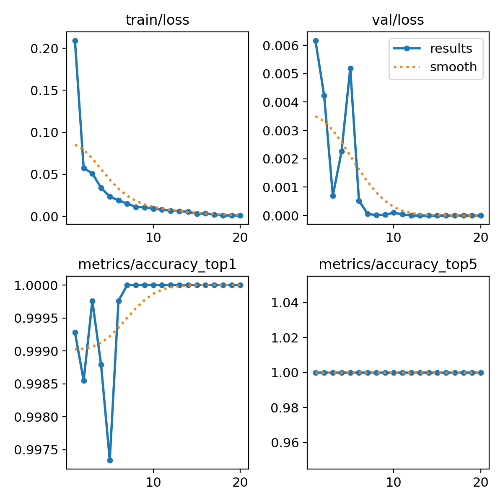
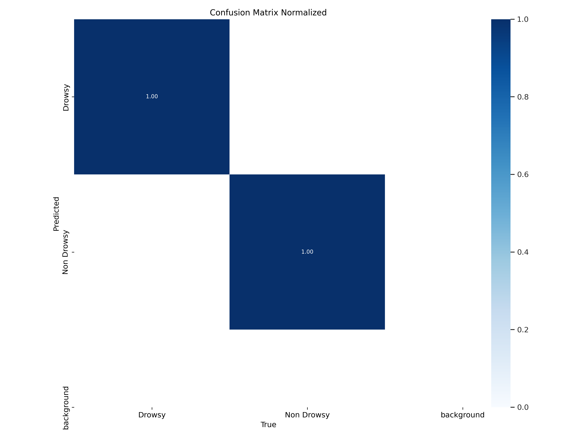
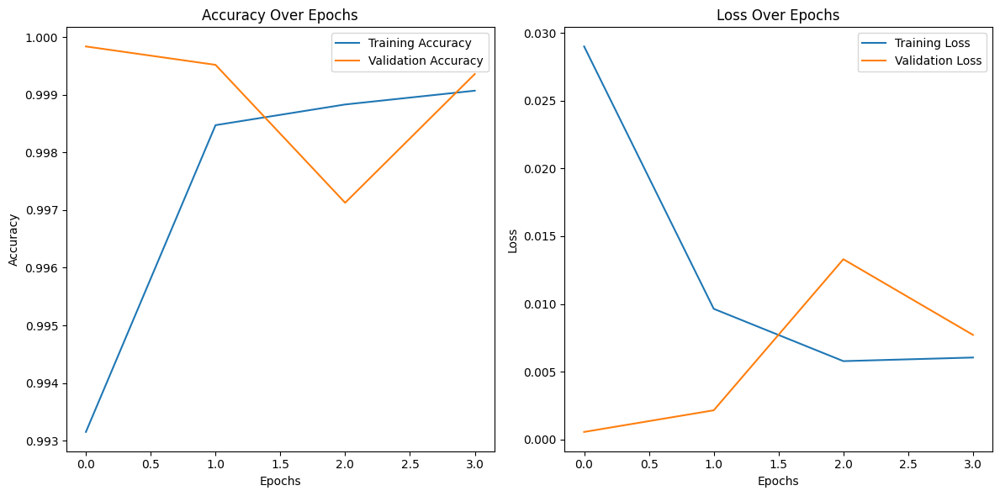
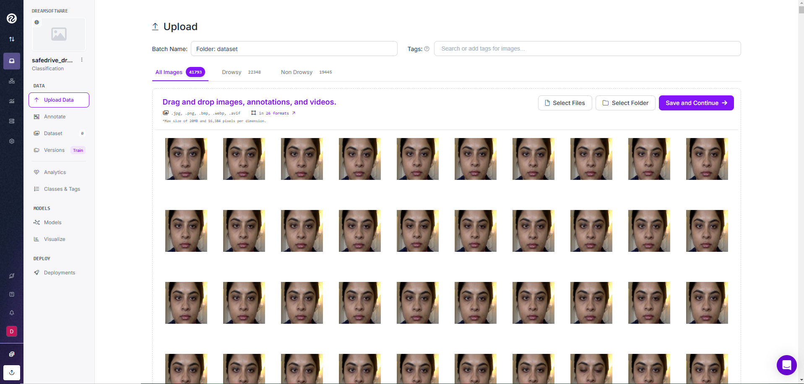
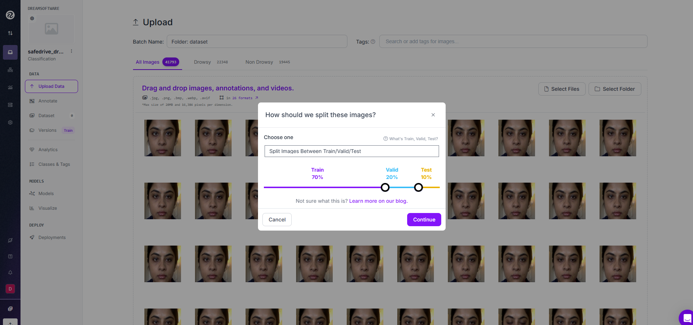
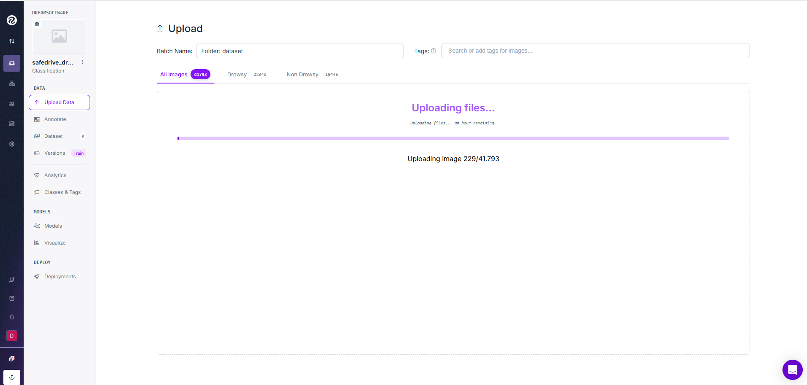

# 🚗 **Deep Learning for Safer Roads** 🚗  Exploring CNN-Based and YOLOv11 Driver Drowsiness Detection 💤


This notebook delves into the exciting world of **deep learning** and its potential to **save lives** on the road. 🚦 We tackle the critical issue of **driver drowsiness detection**, using cutting-edge models to help **prevent fatigue-related accidents**. We explore two powerful approaches: **CNN-based models with Transfer Learning** and **YOLOv8 integrated with Roboflow**. 📊 Let’s see which one emerges as the most effective for **real-time driver monitoring**! ⏱️

<p align="center">
   
   
   
   
   
   
   
</p>

I extend my gratitude to the creators of the **Driver Drowsiness Dataset (DDD)** for providing a high-quality dataset that has been instrumental in training and evaluating our deep learning model for driver drowsiness detection.  

The dataset, derived from the **Real-Life Drowsiness Dataset**, offers a diverse collection of over **41,790 labeled images**, carefully preprocessed to focus on the driver’s facial region. The effort in extracting, annotating, and sharing this dataset greatly contributes to research and development in road safety and accident prevention through deep learning techniques.  

For more details and citation, please refer to the original dataset:  
[Driver Drowsiness Dataset (DDD) on Kaggle](https://www.kaggle.com/datasets/ismailnasri20/driver-drowsiness-dataset-ddd/data)  


🙏 I would like to extend my heartfelt gratitude to [Santiago Hernández, an expert in Cybersecurity and Artificial Intelligence](https://www.udemy.com/user/shramos/). His incredible course on Deep Learning, available at Udemy, was instrumental in shaping the development of this project. The insights and techniques learned from his course were crucial in crafting the neural network architecture used in this classifier.

## 🌟 Explore My Other Cutting-Edge AI Projects! 🌟

If you found this project intriguing, I invite you to check out my other AI and machine learning initiatives, where I tackle real-world challenges across various domains:

+ [🌍 Advanced Classification of Disaster-Related Tweets Using Deep Learning 🚨](https://github.com/sergio11/disasters_prediction)  
Uncover how social media responds to crises in real time using **deep learning** to classify tweets related to disasters.

+ [📰 Fighting Misinformation: Source-Based Fake News Classification 🕵️‍♂️](https://github.com/sergio11/fake_news_classifier)  
Combat misinformation by classifying news articles as real or fake based on their source using **machine learning** techniques.

+ [🛡️ IoT Network Malware Classifier with Deep Learning Neural Network Architecture 🚀](https://github.com/sergio11/iot_network_malware_classifier)  
Detect malware in IoT network traffic using **Deep Learning Neural Networks**, offering proactive cybersecurity solutions.

+ [📧 Spam Email Classification using LSTM 🤖](https://github.com/sergio11/spam_email_classifier_lstm)  
Classify emails as spam or legitimate using a **Bi-directional LSTM** model, implementing NLP techniques like tokenization and stopword removal.

+ [💳 Fraud Detection Model with Deep Neural Networks (DNN)](https://github.com/sergio11?tab=repositories)  
Detect fraudulent transactions in financial data with **Deep Neural Networks**, addressing imbalanced datasets and offering scalable solutions.

+ [🧠🚀 AI-Powered Brain Tumor Classification](https://github.com/sergio11/brain_tumor_classification_cnn)  
Classify brain tumors from MRI scans using **Deep Learning**, CNNs, and Transfer Learning for fast and accurate diagnostics.

+ [📊💉 Predicting Diabetes Diagnosis Using Machine Learning](https://github.com/sergio11/diabetes_prediction_ml)  
Create a machine learning model to predict the likelihood of diabetes using medical data, helping with early diagnosis.

+ [🚀🔍 LLM Fine-Tuning and Evaluation](https://github.com/sergio11/llm_finetuning_and_evaluation)  
Fine-tune large language models like **FLAN-T5**, **TinyLLAMA**, and **Aguila7B** for various NLP tasks, including summarization and question answering.

+ [📰 Headline Generation Models: LSTM vs. Transformers](https://github.com/sergio11/headline_generation_lstm_transformers)  
Compare **LSTM** and **Transformer** models for generating contextually relevant headlines, leveraging their strengths in sequence modeling.

+ [🩺💻 Breast Cancer Diagnosis with MLP](https://github.com/sergio11/breast_cancer_diagnosis_mlp)  
Automate breast cancer diagnosis using a **Multi-Layer Perceptron (MLP)** model to classify tumors as benign or malignant based on biopsy data.

+ [Deep Learning for Safer Roads 🚗 Exploring CNN-Based and YOLOv11 Driver Drowsiness Detection 💤](https://github.com/sergio11/safedrive_drowsiness_detection)
Comparing driver drowsiness detection with CNN + MobileNetV2 vs YOLOv11 for real-time accuracy and efficiency 🧠🚗. Exploring both deep learning models to prevent fatigue-related accidents 😴💡.

## 🚙 **Why is This Important?** 🚙  
Driver fatigue is a major cause of road accidents worldwide 😴. Detecting **drowsy driving** in real-time is crucial for **preventing accidents** and ensuring road safety. This project leverages the **Driver Drowsiness Dataset (DDD)**, a collection of images of drivers in **Drowsy** and **Non-Drowsy** states, to build two different models aimed at **real-time detection** of drowsiness. 🌍

## 💻 **Approaches Explored** 💻  
### **1. CNN-based Models**: The Power of Convolutional Neural Networks 🔍 
CNNs are at the heart of modern image recognition and excel at learning **spatial hierarchies** of image data. For this task, we use **MobileNetV2**, a **lightweight** and **efficient** CNN architecture that’s ideal for **real-time applications** in vehicles. 🚗

- **Why CNNs?**  
   ✅ Efficient at detecting drowsiness through **facial state recognition**.  
   ✅ Works great on **smaller datasets**.  
   ✅ Uses **pre-trained models** to speed up the process. 🏎️

### **2. YOLOv8 with Roboflow**: Real-Time Object Detection at Its Best 🕵️‍♂️  
YOLOv8 is a state-of-the-art **object detection model** designed for **speed** and **accuracy**. Paired with **Roboflow**, YOLOv8 becomes even more powerful by streamlining the **dataset preparation** and **deployment** process. 🚀

- **Why YOLOv8?**  
   ✅ Super fast, making it perfect for **real-time applications**. ⏱️  
   ✅ Capable of **localizing and detecting** multiple objects in a single frame.  
   ✅ **Roboflow integration** simplifies dataset annotation and augmentation. 📝

## 🧠 **How Does the Model Work?** 🧠  
The **Driver Drowsiness Dataset (DDD)** is the foundation for training both models. Here’s what you need to know about the data:

- **Image Format:** RGB images with facial features of drivers.  
- **Classes:** `Drowsy` vs. `Non-Drowsy`.  
- **Resolution:** 227 x 227 pixels, optimized for deep learning tasks.  
- **Size:** 41,790+ labeled images.  
- **File Size:** ~2.32 GB of drowsiness-related data!

## 🔥 **Project Goals** 🔥

1. **Evaluate the two models**—CNN-based transfer learning and YOLOv8 with Roboflow—for detecting **drowsy drivers**.
2. **Compare their performance** using metrics like **accuracy**, **precision**, **recall**, and **F1-score**.
3. **Optimize the models** for real-time deployment in vehicles.

## 🛠️ **Methodology** 🛠️  
We break the project into several stages:

### 1. **Data Preprocessing** 🧹  
- **Normalize** pixel values.  
- **Augment** data to improve generalization.  
- **Split** the dataset into **training**, **validation**, and **testing** sets.

### 2. **Model Development** 💡  
- **Train CNN** models with **MobileNetV2** for transfer learning.  
- **Train YOLOv8** using **Roboflow** for real-time object detection.

### 3. **Model Evaluation** 📊  
- Compare performance using key metrics.  
- **Assess real-time feasibility** for vehicle deployment.

### 4. **Real-Time Testing** ⏱️  
- Simulate **real-world conditions** and evaluate **model responsiveness**.

## 🛣️ **Why Does This Matter?** 🛣️  
This project aims to **reduce road accidents** by **detecting driver fatigue** using AI. Through **deep learning**, we can proactively detect when a driver is drowsy, preventing potential accidents before they happen. **Safer roads** lead to **lives saved**. 🌟

## 🤖 **Comparing the Two Approaches**: CNN + Transfer Learning vs YOLOv8 with Roboflow ⚖️

### **1. CNN + Transfer Learning**: Fast and Effective 🌟
This approach uses **pre-trained CNNs** (e.g., MobileNetV2) to **classify driver states** as drowsy or non-drowsy based on facial images.

- **Pros:**  
  - **Quick setup**.  
  - **Works well with smaller datasets**.  
  - **Pre-trained models** speed up training.

- **Cons:**  
  - **No object localization**.  
  - **Limited real-time suitability** due to preprocessing.  
  - May struggle with **high-resolution data**.

### **2. YOLOv8 + Roboflow**: Real-Time Detection 🚀  
YOLOv8 excels at **detecting and localizing objects** (e.g., faces, eyes) in real-time, especially when paired with **Roboflow**.

- **Pros:**  
  - **Perfect for real-time detection**.  
  - **Detects and localizes** multiple objects at once.  
  - Simplified data preparation via **Roboflow**.

- **Cons:**  
  - **Resource-heavy**, requiring powerful hardware.  
  - **Higher complexity** in setup and fine-tuning.  
  - **Time-intensive annotations** for accurate detection.

### **Side-by-Side Comparison**

| **Aspect** | **CNN + Transfer Learning** | **YOLOv8 + Roboflow** |
|------------|-----------------------------|-----------------------|
| **Primary Goal** | Classification (Drowsy vs. Non-Drowsy) | Real-Time Detection and Localization |
| **Real-Time Suitability** | Limited (Preprocessing adds latency) | Optimized for real-time applications |
| **Ease of Use** | Beginner-friendly, quick setup | More complex, streamlined with Roboflow |
| **Dataset Needs** | Small to moderate datasets | Detailed annotations, larger datasets |
| **Performance Focus** | Classification Accuracy | Speed + Detection Accuracy |
| **Hardware Requirements** | Moderate (CPUs or mid-tier GPUs) | High (Powerful GPUs recommended) |

## 📱 **Choosing the Best Approach for Mobile Integration** 🤖  
When integrating the drowsiness detection model into a **mobile application**, we need to consider specific factors such as **real-time performance**, **model size**, and **resource limitations**. Let's explore the strengths of each approach and decide which one fits best for mobile deployment with **TensorFlow Lite** or **YOLOv8**.

### **1. CNN + Transfer Learning (MobileNetV2)**: Lightweight and Efficient 🚀  
If you're building a **mobile app** where **speed** and **efficiency** are critical, CNN-based models like **MobileNetV2** are a great option.

- **Why use CNN + Transfer Learning for Mobile?**  
  - 🏎️ **Lightweight and fast**: MobileNetV2 is designed for **resource-constrained environments**, making it perfect for **real-time mobile applications**.
  - 📉 **Smaller model size**: Using **TensorFlow Lite**, the model can be deployed as a **compact version** to the mobile device.
  - ⚡ **Real-time performance**: MobileNetV2 ensures **real-time drowsiness detection** even on devices with lower processing power.

- **When should you use it?**  
  - You have **limited hardware resources** (e.g., mobile devices with moderate performance).
  - You need a **lightweight and fast** model that works efficiently with **TensorFlow Lite**.
  - You don’t need **object localization** or detecting multiple features within the image.

### **2. YOLOv8 with Roboflow**: Real-Time Detection with Robust Features 🔥  
**YOLOv8** excels in **object detection** and is ideal if your mobile app requires **real-time detection** and **localization** of features like faces or eyes.

- **Why use YOLOv8 for Mobile?**  
  - ⚡ **High-speed detection**: YOLOv8 is **optimized for real-time processing**, making it perfect for **mobile apps** that need **fast response times**.
  - 🛠️ **Advanced localization**: YOLOv8 can **detect and localize facial features**, offering more **detailed insights** into the driver’s state.
  - 🏋️‍♂️ **Better for powerful devices**: If you’re targeting **high-end devices** with robust processing power, YOLOv8 will deliver optimal performance.

- **When should you use it?**  
  - Your mobile app needs to **detect multiple objects** or **localize faces/eyes**.
  - You have access to **high-performance hardware** on the device (e.g., **high-end smartphones**).
  - You need a **complete detection and classification system** in a single pipeline.

### **Which One to Choose for TensorFlow Lite or YOLO?**
- **Go for CNN + Transfer Learning (MobileNetV2)** if:  
  - You need a **lightweight** model that runs **efficiently** on **mobile devices** with **limited computational power**.
  - You're aiming for **real-time performance** with a **fast deployment** using **TensorFlow Lite**.

- **Go for YOLOv11 with Roboflow** if:  
  - You need **advanced object detection** and **localization** (e.g., detecting faces or eyes).
  - Your app will run on **high-performance mobile devices** that can handle the increased computational load.
  - You want an **end-to-end system** that seamlessly combines **real-time detection** and **classification**.

### Final Thoughts 🧠  
Both models have their strengths, and the best choice will depend on the **specific needs** of your **mobile app**. If you're looking for a **lightweight** and **efficient** model for **real-time performance**, **MobileNetV2** is the way to go. However, if your focus is on **advanced detection and localization** with **high-end hardware**, **YOLOv8** will offer the performance you need for a **powerful real-time solution**. 🚀

### Screenshots









## 🚀 **Let’s Dive In!** 🚀  
Both models are powerful tools for **driver drowsiness detection**, and each offers unique benefits. The choice of approach depends on your specific goals, dataset, and available resources.

## **📚 References**
- [How to train a YOLOv8 classification model](https://blog.roboflow.com/how-to-train-a-yolov8-classification-model/)
- [Real time object detection in android with yolov11](https://www.tensorflow.org/)
- [Transfer learning](https://www.kaggle.com/code/esraameslamsayed/driver-drowsiness-detection-cnn-mobilenetv)
- [Dataset](https://www.kaggle.com/datasets/ismailnasri20/driver-drowsiness-dataset-ddd/data)

## **🙏 Acknowledgments**

A huge **thank you** to **Ismail Nasri** for providing the dataset that made this project possible! 🌟 The dataset can be found on [Kaggle](https://www.kaggle.com/datasets/ismailnasri20/driver-drowsiness-dataset-ddd/data). Your contribution is greatly appreciated! 🙌

A special thank you to **Esraa Meslam Sayed** for the invaluable inspiration provided through his project, [**Driver Drowsiness Detection🚘😴(CNN ||MobileNetV2)**](https://www.kaggle.com/code/esraameslamsayed/driver-drowsiness-detection-cnn-mobilenetv2). His work laid the foundation for the development of this model and greatly influenced the approach taken in this project. The insights and techniques explored in his work served as a key resource, helping to guide the creation of an effective and robust diabetes prediction model. We truly appreciate the effort and dedication put into his research and contributions to the data science community

🙏 I would like to extend my heartfelt gratitude to [Santiago Hernández, an expert in Cybersecurity and Artificial Intelligence](https://www.udemy.com/user/shramos/). His incredible course on Deep Learning, available at Udemy, was instrumental in shaping the development of this project. The insights and techniques learned from his course were crucial in crafting the neural network architecture used in this classifier

## Contribution

Contributions to this project are highly encouraged! If you're interested in adding new features, resolving bugs, or enhancing the project's functionality, please feel free to submit pull requests.

## Get in Touch 📬

this project is developed and maintained by **Sergio Sánchez Sánchez** (Dream Software). Special thanks to the open-source community and the contributors who have made this project possible. If you have any questions, feedback, or suggestions, feel free to reach out at  [dreamsoftware92@gmail.com](mailto:dreamsoftware92@gmail.com).

## Visitors Count


## Please Share & Star the repository to keep me motivated.
  <a href = "https://github.com/sergio11/safedrive_drowsiness_detection/stargazers">
     
  </a>

## License ⚖️

This project is licensed under the MIT License, an open-source software license that allows developers to freely use, copy, modify, and distribute the software. 🛠️ This includes use in both personal and commercial projects, with the only requirement being that the original copyright notice is retained. 📄

Please note the following limitations:

- The software is provided "as is", without any warranties, express or implied. 🚫🛡️
- If you distribute the software, whether in original or modified form, you must include the original copyright notice and license. 📑
- The license allows for commercial use, but you cannot claim ownership over the software itself. 🏷️

The goal of this license is to maximize freedom for developers while maintaining recognition for the original creators.

```
MIT License

Copyright (c) 2025 Dream software - Sergio Sánchez 

Permission is hereby granted, free of charge, to any person obtaining a copy
of this software and associated documentation files (the "Software"), to deal
in the Software without restriction, including without limitation the rights
to use, copy, modify, merge, publish, distribute, sublicense, and/or sell
copies of the Software, and to permit persons to whom the Software is
furnished to do so, subject to the following conditions:

The above copyright notice and this permission notice shall be included in all
copies or substantial portions of the Software.

THE SOFTWARE IS PROVIDED "AS IS", WITHOUT WARRANTY OF ANY KIND, EXPRESS OR
IMPLIED, INCLUDING BUT NOT LIMITED TO THE WARRANTIES OF MERCHANTABILITY,
FITNESS FOR A PARTICULAR PURPOSE AND NONINFRINGEMENT. IN NO EVENT SHALL THE
AUTHORS OR COPYRIGHT HOLDERS BE LIABLE FOR ANY CLAIM, DAMAGES OR OTHER
LIABILITY, WHETHER IN AN ACTION OF CONTRACT, TORT OR OTHERWISE, ARISING FROM,
OUT OF OR IN CONNECTION WITH THE SOFTWARE OR THE USE OR OTHER DEALINGS IN THE
SOFTWARE.
```
